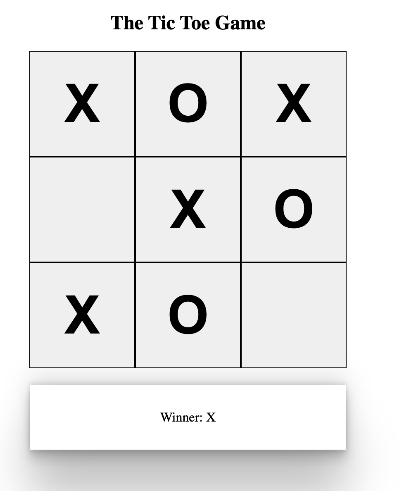

## Tic Tac Toe Game

This is a simple console-based Tic Tac Toe game implemented in ReactJs. Players take turns to mark their symbol (X or O) on a 3x3 grid. The player who succeeds in placing three of their marks in a horizontal, vertical, or diagonal row wins the game.

### How to Play

1. Run the game on your local machine.
2. Players take turns entering the row and column numbers (1 to 3) to place their symbol.
3. The game continues until a player wins or the grid is filled.
4. If a player successfully aligns three of their symbols, they win the game. If the grid is filled without a winner, the game ends in a draw.

### Features

- **Simple and Intuitive:** Easy-to-understand interface for a quick and enjoyable gaming experience.
- **Multiplayer:** Play against a friend and test your Tic Tac Toe skills.

### Installation

1. Clone the repository to your local machine
2. Navigate to the project directory and run the game
3. Open the game in your browser at http://localhost:3000.

### Screenshots
